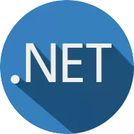

### 👋 Hi there, I'm Andy

## Full Stack Software Developer

- 👨‍💻 Self-taught programmer creating software since 2015
- 🧑‍🔬 Big fan of automated testing, continous delivery and clean coding practices
-  I create YouTube videos about how to become a self-taught software developer

### Connect with me:

Languages & Tools:

